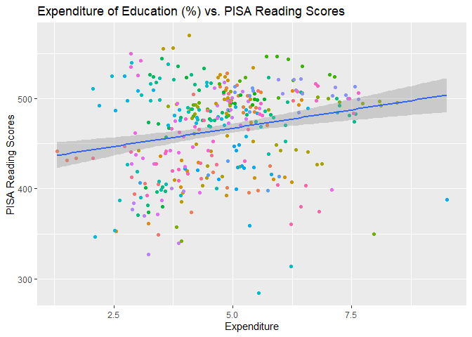

We can use this function to get data from Worldbank API:

```r
library(tidyverse)
library(httr)
library(jsonlite)

get_specific_id <- function(country_1_code, indicator_code, number_values = 20000) {
  url <- paste0("https://api.worldbank.org/v2/country/", country_1_code, "/indicator/", indicator_code, "?format=json&per_page=", number_values) # forms an URL based on what we want in arguments
  
  result <- GET(url) # We use the URL to GET the result
  
  if (http_type(result) == "application/json") { # IF ordinary API response
    data <- content(result, as = "text") %>%
      fromJSON() %>%
      .[[2]] %>% # generally the juicy parts are at [2] 
      na.omit(value) %>% # cleaning rows with NA values 
      as_tibble()
    
    df_name_var <- paste0(indicator_code, "_", country_1_code) # dynamic dataframe name based on indicator and country
    assign(df_name_var, data, envir = .GlobalEnv) # assigns data to that dataframe and to environment
    saveRDS(data, file = paste0("./rds/", df_name_var, "_", Sys.Date(), ".rds")) # and outputs with a dynamic filename
    
  } else { # ELSE with erroneous API response
    error_msg <- content(result, as = "text") 
    cat("API Error:", error_msg, "\n")
    return(NULL)
  }
}
```
It creates a file named ./rds/"indicator"_"date".rds for later use. But how do we know which indicators are available? With this function:


```r
library(tidyverse)
library(httr)
library(jsonlite)

id_list <- 
  GET("https://api.worldbank.org/v2/indicator?format=json&per_page=21020") %>%
  content(as = "text") %>%
  fromJSON() %>%
  .[[2]] %>%
  select(id, name, sourceNote) %>%
  rename(id_code = id, id_name = name, id_about = sourceNote) %>% # modifies to more useful column names, sourceNote gives useful short explanations on indicators, better keep them
  select(id_code, id_name, id_about) %>%
  as_tibble()

save(id_list, 
     file = "id_list.rda") # outputs as rda
```
It seems there are 21020 of them. We need a way to search to be able to quickly browse through them. This function searches through the names of indicators for maximum of 3 words bound with logical AND:


```r
library(tidyverse)

search_id <- function(param_1, param_2 = NULL, param_3 = NULL) {
  load("id_list.rda")
  
  search_result <- id_list %>%
    filter(
      str_detect(id_name, regex(param_1, ignore_case = TRUE)) &
        if (!is.null(param_2)) str_detect(id_name, regex(param_2, ignore_case = TRUE)) else TRUE &
        if (!is.null(param_3)) str_detect(id_name, regex(param_3, ignore_case = TRUE)) else TRUE
    ) %>%
    select(id_code, id_name, id_about) %>%
    as_tibble()
  
  assign("search_result", search_result, envir = .GlobalEnv)
  
  return(search_result)
}
```
Now, we have our PISA reading scores (LO.PISA.REA_all_2023-09-30.rds) and education expenditures (SE.XPD.TOTL.GD.ZS_all_2023-09-30.rds), we will join

```r
pisa_results <- readRDS("./rds/LO.PISA.REA_all_2023-09-30.rds") # assigning meaningful names 
head(pisa_results) # just to show how the dataframe looks like 
```

```
## # A tibble: 6 × 8
##   indicator$id country$id countryiso3code date  value unit  obs_status decimal
##   <chr>        <chr>      <chr>           <chr> <dbl> <chr> <chr>        <int>
## 1 LO.PISA.REA  OE         OED             2018   487. ""    ""               0
## 2 LO.PISA.REA  AL         ALB             2018   405. ""    ""               0
## 3 LO.PISA.REA  AL         ALB             2015   405. ""    ""               0
## 4 LO.PISA.REA  AL         ALB             2012   394. ""    ""               0
## 5 LO.PISA.REA  AL         ALB             2009   385. ""    ""               0
## 6 LO.PISA.REA  AL         ALB             2000   349. ""    ""               0
## # ℹ 2 more variables: indicator$value <chr>, country$value <chr>
```

```r
expenditure <- readRDS("./rds/SE.XPD.TOTL.GD.ZS_all_2023-09-30.rds") # assigning meaningful names 
head(expenditure) # just to show how the dataframe looks like
```

```
## # A tibble: 6 × 8
##   indicator$id   country$id countryiso3code date  value unit  obs_status decimal
##   <chr>          <chr>      <chr>           <chr> <dbl> <chr> <chr>        <int>
## 1 SE.XPD.TOTL.G… ZH         AFE             2020   4.61 ""    ""               1
## 2 SE.XPD.TOTL.G… ZH         AFE             2019   4.60 ""    ""               1
## 3 SE.XPD.TOTL.G… ZH         AFE             2018   4.83 ""    ""               1
## 4 SE.XPD.TOTL.G… ZH         AFE             2017   4.86 ""    ""               1
## 5 SE.XPD.TOTL.G… ZH         AFE             2016   4.82 ""    ""               1
## 6 SE.XPD.TOTL.G… ZH         AFE             2015   4.82 ""    ""               1
## # ℹ 2 more variables: indicator$value <chr>, country$value <chr>
```

```r
cleaned_pisa <- pisa_results %>% # preparing the dataframe for join
  mutate(country = countryiso3code) %>% 
  rename(value_pisa = value) %>% 
  select(country, date, value_pisa)
  
head(cleaned_pisa) # new state
```

```
## # A tibble: 6 × 3
##   country date  value_pisa
##   <chr>   <chr>      <dbl>
## 1 OED     2018        487.
## 2 ALB     2018        405.
## 3 ALB     2015        405.
## 4 ALB     2012        394.
## 5 ALB     2009        385.
## 6 ALB     2000        349.
```

```r
cleaned_exp <- expenditure %>% # preparing the dataframe for join
  mutate(country = countryiso3code) %>% 
  rename(value_exp = value) %>% 
  select(country, date, value_exp)
head(cleaned_exp) # new state
```

```
## # A tibble: 6 × 3
##   country date  value_exp
##   <chr>   <chr>     <dbl>
## 1 AFE     2020       4.61
## 2 AFE     2019       4.60
## 3 AFE     2018       4.83
## 4 AFE     2017       4.86
## 5 AFE     2016       4.82
## 6 AFE     2015       4.82
```

```r
joined <- inner_join(cleaned_pisa, cleaned_exp, by = c("country", "date")) # inner joining the two dataframes by their "country" and "date" column
head(joined) # joined dataframe
```

```
## # A tibble: 6 × 4
##   country date  value_pisa value_exp
##   <chr>   <chr>      <dbl>     <dbl>
## 1 OED     2018        487.      4.90
## 2 ALB     2018        405.      3.15
## 3 ALB     2015        405.      3.44
## 4 ALB     2012        394.      2.93
## 5 ALB     2000        349.      3.43
## 6 DZA     2015        350.      7.96
```

```r
rm(list = c("pisa_results", "expenditure", "cleaned_pisa", "cleaned_exp")) # clean the environment from all those dataframes we created
```


## Msaffasfasfasanic

asfasasfasfsaffsa


```r
model <- lm(value_pisa ~value_exp, joined) # This is the part we actually create our model. we ask if "value_pisa" values depend on "value_exp" values in the "joined" dataframe. 
summary(model)
```

```
## 
## Call:
## lm(formula = value_pisa ~ value_exp, data = joined)
## 
## Residuals:
##     Min      1Q  Median      3Q     Max 
## -186.94  -36.96   12.93   32.74  109.91 
## 
## Coefficients:
##             Estimate Std. Error t value Pr(>|t|)    
## (Intercept)  426.538      9.681  44.057  < 2e-16 ***
## value_exp      8.128      1.956   4.154 4.08e-05 ***
## ---
## Signif. codes:  0 '***' 0.001 '**' 0.01 '*' 0.05 '.' 0.1 ' ' 1
## 
## Residual standard error: 49.36 on 357 degrees of freedom
## Multiple R-squared:  0.04612,	Adjusted R-squared:  0.04344 
## F-statistic: 17.26 on 1 and 357 DF,  p-value: 4.085e-05
```

```r
ggplot(data = joined, aes(x = value_exp, y = value_pisa)) +
  geom_point(mapping = aes(color = country)) +
  geom_smooth(method = "lm", se = TRUE) +
  guides(color = "none")+
  labs(
    title = "Expenditure of Education (%) vs. PISA Reading Scores",
    x = "Expenditure",
    y = "PISA Reading Scores"
  )
```

```
## `geom_smooth()` using formula = 'y ~ x'
```

<!-- -->

asfasfas


sfafasasf
